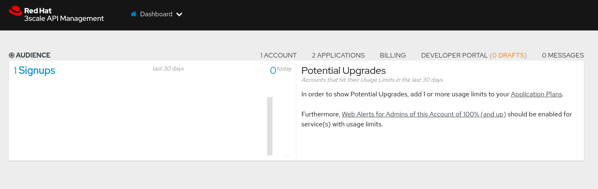
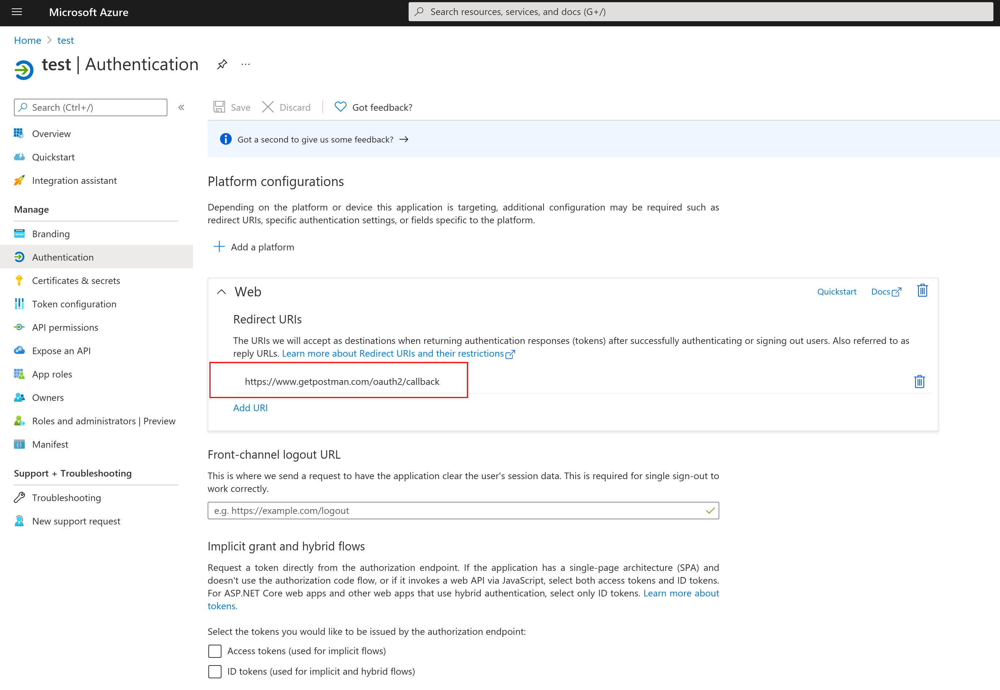
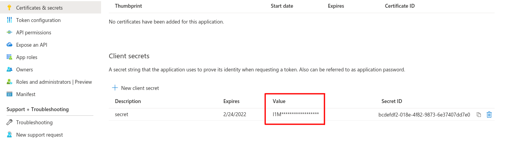
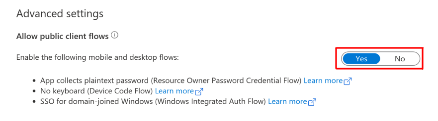
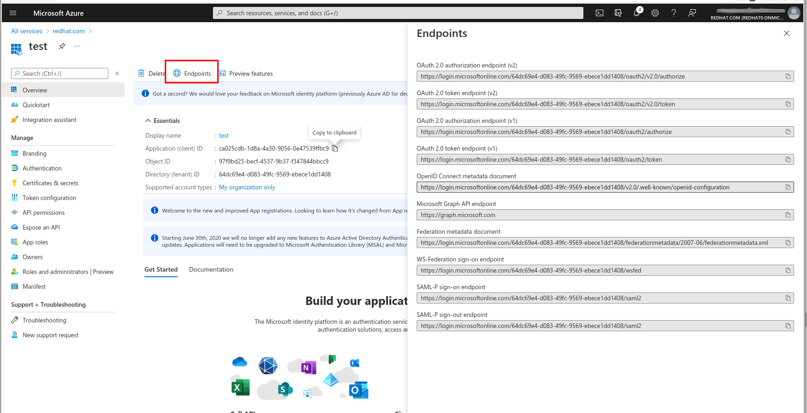
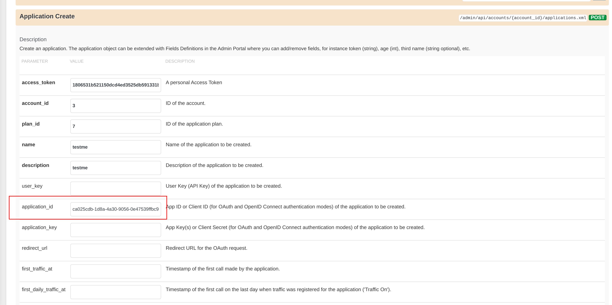
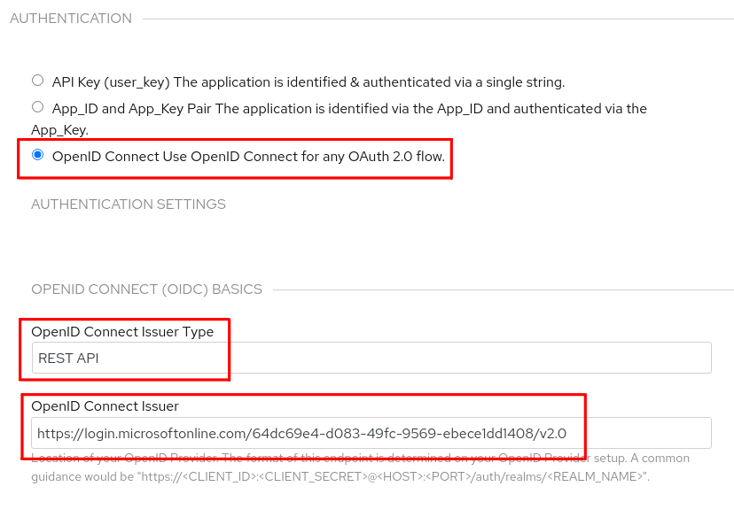
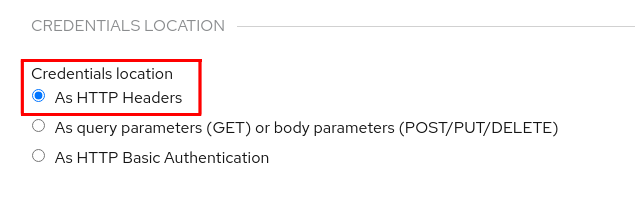

# 3scale Azure Active Directory Demo

A common use case for 3scale is the ability to integrate to 3rd party Identity Providers (IDP). There have been a number of previous integrations blogged about:

- [Okta](https://developers.redhat.com/blog/2020/11/09/openid-connect-integration-with-red-hat-3scale-api-management-and-okta)
- [Forgerock](https://developers.redhat.com/blog/2018/03/12/3scale-red-hat-integration-forgerock-using-openid-connect)

I am going to run through a similar scenario using Azure Active Directory. The example use case is as follows:

- Identity managed in Azue Active Directory (AAD)
- OIDC/OAuth Authorization Code Flow
- 3scale API Management running in OpenShift


### A note about OIDC/Oauth2

A lot of the complexity exists today when integrating Authentication and Authorization into modern cloud applications. There are different implementations and interpretations of the standards by various products. 3scale can be configured to cater for some of these variations.

The core OAuth specification, [RFC 6749](https://tools.ietf.org/html/rfc6749), is widely supported and deployed, and it can be extended to support novel use cases, such as a device grant. In addition, you can leverage OAuth2 (there are about 11 RFC's you should read that cover it) to build a secure auth system. OAuth2 is also easier for clients to implement than protocols like SAML. Recent work on OAuth 2.1 consolidates some of these RFCs.

OpenID Connect [OIDC](https://openid.net/specs/openid-connect-core-1_0.html) is an authentication protocol built on OAuth 2.0 that you can use to  securely sign in a user to an application.

A Refresher:

**Oauth2**
- Authorization Code Grant
- Implicit Grant (deprecated in OAuth 2.1 draft)
- Resource Owner Password Credential Grant (deprecated in OAuth 2.1 draft)
- Client Credential Grant

**OIDC adds these in top of OAuth2**
- Authorization Code Flow
- Implicit Flow
- Hybrid Flow

### Setup and Prerequisites

The following software, access and infrastructure is required:

| Component     | Version Used  | URL       | Comments
| ------------- |:-------------:|:--------- |:-------- |
| OpenShift 4 | 4.8 | https://try.openshift.com/ | We are using Operator Lifecylce Manager. *cluster-admin* access is required.
| 3Scale Operator | 0.7 | https://github.com/3scale/3scale-operator | We will use the Operator to deploy v2.10 of 3Scale API Management.
| Azure Active Directory | Azure | https://login.microsoftonline.com | SaaS service, you will need a microsoft login. Registering applications is free to do.
| Postman | v8.11 | https://www.postman.com | Any modern version should do. You can also just use command-line equivalents if you wish.

We are going to assume you have installed or have access to an OpenShift 4 cluster and have some familiarty with the tooling used. You also need to have a working microsoft account and have postman installed.

### Installing and Accessing 3Scale

We are going to use the Operator Lifecycle Manager in OpenShift to install 3Scale which is suitable for demoing. Don't use this for production or large scale deployments. Read the [product documentation](https://access.redhat.com/documentation/en-us/red_hat_3scale_api_management/2.10/html-single/installing_3scale/index) if you need more details.

Goto *Operators -> OperatorHub*. Search and install the *Red Hat Integration - 3scale* operator. Create a project, i used **3scale** and select the version you require. It should look like this after you have installed it.


Create an *API Manager* resource from the operator api. You will need to specify a wildcard domain. I used *<project>.<cluster app domain>*. The system-storage PVC also requires RWX, so i used a shared storage class *aws-efs* for this. Your may need to tweak this based on your cluster setup.

```yaml
apiVersion: apps.3scale.net/v1alpha1
kind: APIManager
metadata:
  name: apimanager
spec:
  wildcardDomain: 3scale.apps.hivec.sandbox56.opentlc.com
  resourceRequirementsEnabled: false
  system:
    fileStorage:
      persistentVolumeClaim:
        storageClassName: aws-efs
```

Once created you should see a number of pods running:

```bash
$ oc -n 3scale get pods | grep Running

3scale-operator-d6dddb4ff-hzzxb   1/1     Running     0          27h
apicast-production-1-cl28d        1/1     Running     0          27h
apicast-staging-5-s4cn2           1/1     Running     0          16h
backend-cron-1-xrwbs              1/1     Running     0          27h
backend-listener-1-wdkgv          1/1     Running     0          27h
backend-redis-1-ncrfz             1/1     Running     0          27h
backend-worker-1-2dprp            1/1     Running     0          27h
system-app-1-dfrj2                3/3     Running     0          26h
system-memcache-1-mdb4p           1/1     Running     0          27h
system-mysql-1-24bb7              1/1     Running     0          27h
system-redis-1-c2vh4              1/1     Running     0          27h
system-sidekiq-1-l67h7            1/1     Running     0          27h
system-sphinx-1-p5jl7             1/1     Running     0          27h
zync-1-pqw5x                      1/1     Running     0          27h
zync-database-1-6rbbq             1/1     Running     0          27h
zync-que-1-6xkw4                  1/1     Running     0          27h
```

You can now access 3scale admin WebUI. We are going to use the default master tenant in 3Scale but you can create more if you need. You can find the login details in the *system-seed* secret:

```bash
oc -n 3scale get secret system-seed -o json | jq -r .data.ADMIN_USER | base64 -d
oc -n 3scale get secret system-seed -o json | jq -r .data.ADMIN_PASSWORD | base64 -d
```



### Register an Application in Azure AD

Login to microsoft azure, and follow the instructions here to [register and application](https://docs.microsoft.com/en-us/azure/active-directory/develop/quickstart-register-app) in azure active directory.

I called my application *test*


When going through the registration form, select the following:

- a web application
- add the redirect url as *https://www.getpostman.com/oauth2/callback*



- accessible by accounts in your organisation only


Ok, once that created it should look like this:

- Take note of the **Application (client) ID* in particular as we need this value later on.


We need to add in two more bits of configuration. First goto *Certificates & Secrets* and add a client *secret*. We will need this value later on.



Under *Authentiction* enable *Allow public client flows* so we can access this registered application from 3scale.



Finally, you can check out the OIDC compliant *well-known* configuration endpoint which is publicly available for you app. Mine looks like this:

```bash
https://login.microsoftonline.com/64dc69e4-d083-49fc-9569-ebece1dd1408/v2.0/.well-known/openid-configuration
```




### Create 3scale Application

For the first step, we need to register a client application in 3scale that has an ID that matches the Azure AD *Application (client) ID*. It's worth noting that syncing of client id's and 3scale is automated for IDP's such as Keycloak/Red Hat SSO, but is manual for external IDP's like AAD.

To set the ID, we must make use of the 3scale API directly (dont create the client from the Web Form). In 3Scale browse to *Account Settings -> Integrate -> 3Scale API Docs*. Find the *Application Create* API. fill in the:

- *access_token* - find this is under *Account Settings -> Personal -> Tokens* for the *API* Service
- *account_id* - this should drop-down when you select it, select the account id
- *plan_id* - this should drop-down when you select it, select the plan id
- *name* - give your application a name
- *desciption* - give your application a description
- *application_id* - importantly fill this id with the Azure AD *Application (client) ID*



Make sure the default user *Developer* has an Application Plan, i created a *Basic* plan, and the Application you just created is available under the *API* Product.


### 3Scale Configuration for Token Validation

The default *API* Product setup should have a *Backend* that is already setup. Browse to *Products-> API -> Integrations -> Backend*. It should look like this i.e. our backend is pointing to the 3Scale echo service:


Now browse to *Integration -> Settings*. We are going to configure *Authentication* for AAD.

- Select *Authentication -> OpenID Connect Use OpenID Connect for any OAuth 2.0 flow.*
- Fill in the *OpenID Connect Issuer Type* -> REST API
- Copy from the AAD well-known configuration the Issuer endpoint and fill in the *OpenID Connect Issuer* ->  https://login.microsoftonline.com/<teanant id>/v2.0

For example:



Next, configure the *OIDC Authorization Flow*. 

- Select the flows you wish to support. 
- Importantly, change the default *ClientID Token Claim* from *azp* to *aud*. 
- In the JWT Token the name of this field matches where the Azure AD *Application (client) ID* can be found in the token.

Different IDP's do this differently so you often need to [inspect your JWT token](https://jwt.io/) to make sure it is correct. We will do this in a later step. For now, it should look like this:


Finally, set the *Credentials Location* to be *As HTTP Headers*



Save this by selecting **Update Product*.

The *Integration -> Configuration* tab should highlight that you need to promote this configuration to an environment. 

Browse to the *Integration -> Configuration* tab and promote this to the *Staging APIcast* gateway.


We should not have an API and Route exposed. If you try to curl or browse to this though you will get `HTTP/1.1 403 Forbidden` and `Authentication parameters missing` message. Next we will get a valid token for the gateway to validate.

```bash
curl -k https://api-3scale-apicast-staging.3scale.apps.hivec.sandbox56.opentlc.com:443

Authentication parameters missing
```

### Using Postman to Get a Token

The *Consumer* in the use case diagram will be postman (or curl). This of course would be a real web application in real life. We are going to use the *OIDC/OAuth2 - Authorization Code Flow* in this example. The IDP and 3Scale supports multiple flows. So if you change this, be sure your token fields line up with the app configuration in 3Scale else validation will not work.

For this demo, login to your postman app and create a workspace. You can make use of [postman variables](https://learning.postman.com/docs/sending-requests/variables/) if you want, for now we just past these directly into the *Authorization* form based on our AAD Application setup.


Variable values:


The *Client Secret* is sensitive so don't check that in un-encypted anywhere.

Select *Get New Access Token* which should open up a login to microsoft, fill in your username and password to access.

You should see **Authentication complete** click *Proceed* which will give you a token details page containing two tokens for this flow:

- Access Token


- id_token (Bearer Token)


[Inspect your JWT tokens](https://jwt.io/) you can see for the OAuth Bearer token that the **aud** field matched the Azure AD *Application (client) ID*. The default token expiry is 1hr. We do not cover Refresh tokens here, but in a normal setup the *Consumer* will be able to handle refreshes of the token from the IDP to avoid having to login in again.


### Testing 3scale Token Validation

We should have all the pieces in place now for 3scale to validate our tokens against Azure AD. Use curl or postman to call the 3scale echo API: 

```bash
TOKEN=<bearer token here>
curl -k -H "Authorization: Bearer ${TOKEN}" https://api-3scale-apicast-staging.3scale.apps.hivec.sandbox56.opentlc.com:443
```


🥂🥂 Celebrate your success 🥂🥂

If things are not working, add debug to your 3scale staging apicast gateway deployment in OpenShift by adding these environment variables.

```bash
APICAST_LOG_LEVEL=debug
APICAST_OIDC_LOG_LEVEL=debug
```

And check for error messages in the gateway pod logs.

### Complex Backend Service Interactions

The external service encapsulated by the backend in this example was publicy available https://echo-api.3scale.net:443. Normally this would be protected as well and not publicly exposed.

- If this was an Application in the same OpenShift cluster as the 3Scale Apicast gateway, use the *Service* as the backend URL.
- The backend service may also be registered in AAD and the token used for claim / role checking.
- If it is an External Service with AppID/AppKey Basic Auth - use 3Scale's [Header Modification Policy](https://access.redhat.com/documentation/en-us/red_hat_3scale_api_management/2.10/html-single/administering_the_api_gateway/index#header_modification) to inject these credentials downstream.
- If a more complex service interaction is required, Consider 3Scale's Proxy Service, or Camel/Quarkus/Kamelet integration.
